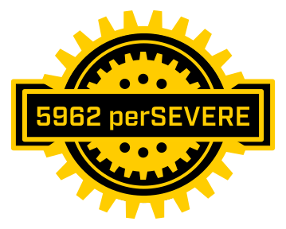

# FRC Team 5962 Robot Code for the 2026/2027 season

[](https://github.com/perSEVERE-5962/2027RobotCode/blob/main/LICENSE) 


---
## Branch Workflow
```text
feature/alice-arm ──────┐
                        │
feature/bob-shooter ────┼──► integration ──► main
                        │
feature/charlie-auto ───┘
```
Our repository follows a simple promotion model:

**Feature branches → `integration` → `main`**

Students develop features on their own branches created off of `integration` and submit pull requests to `integration`. After changes have been integrated and tested, `integration` is promoted to `main`.

`main` represents the code ready for competition

> **Do not merge feature branches directly into `main` or into other feature branches.**
---
## 2027 Stack

| Piece | What we use |
|---|---|
| Controller | SystemCore, WPILib 2027 (currently `2027.0.0-alpha-6`) |
| Framework | Java 25, Commands v3, AdvantageKit `27.0.0-alpha-4` |
| Drivetrain | SDS MK5n swerve: Kraken motors, CANcoder azimuth encoders, Pigeon 2 gyro, all on CTRE Phoenix 6 `26.50.0-alpha-1` |
| Vision | PhotonVision, `photonlib v2027.0.0-alpha-2` |

Vendordeps live in `vendordeps/` and the versions are pinned by hand on purpose: the
2027 alpha vendors do not serve reliable "check for updates" JSONs yet (CTRE's 404s,
AdvantageKit's points at the 2026 line), so the VS Code update check can silently
downgrade the project. Bump versions deliberately, one PR at a time, against the
vendor's release notes.
---
📘 Our docs are proudly hosted with support from GitBook.
